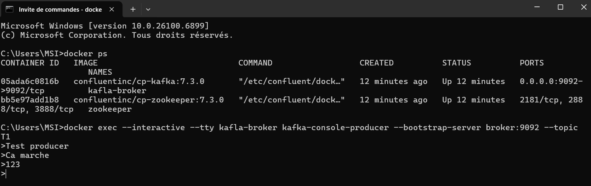

# Activité Pratique N°1 – Event Driven Architecture avec Kafka

## Introduction

Cette activité pratique a pour objectif de mettre en œuvre une **architecture pilotée par les événements (Event Driven Architecture)** en utilisant **Apache Kafka** et **Spring Cloud Stream**.

L'objectif principal est de comprendre le fonctionnement d'un système distribué basé sur des flux de messages asynchrones, ainsi que d'explorer les concepts de **Producer**, **Consumer**, **Supplier** et **Stream Processing** au sein d'un écosystème Kafka.  
Le tout est déployé dans un environnement **Docker** afin de faciliter la configuration et l'exécution des différents services.

---

## I. Mise en place de l'environnement Kafka avec Docker

### 1. Création du fichier `compose.yml`
Dans cette première étape, un fichier **`compose.yml`** a été créé afin d’orchestrer le déploiement des conteneurs nécessaires au fonctionnement de Kafka.  
Ce fichier définit deux services principaux :

- **Zookeeper** : service essentiel utilisé par Kafka pour la coordination et la gestion du cluster. Il écoute sur le port `2181` et utilise l’image officielle `confluentinc/cp-zookeeper:7.3.0`.  
  Ses paramètres d’environnement spécifient le port client et le temps d’attente entre les ticks (`ZOOKEEPER_TICK_TIME`).

- **Kafka Broker** : service principal de messagerie, basé sur l’image `confluentinc/cp-kafka:7.3.0`.  
  Il dépend du conteneur Zookeeper et est exposé sur le port `9092` pour permettre la communication avec les producteurs et consommateurs Kafka.  
  Les variables d’environnement définissent :
    - l’**ID du broker** (`KAFKA_BROKER_ID`),
    - la **connexion à Zookeeper** (`KAFKA_ZOOKEEPER_CONNECT`),
    - les **protocoles et adresses d’écoute** internes et externes (`KAFKA_LISTENER_SECURITY_PROTOCOL_MAP`, `KAFKA_ADVERTISED_LISTENERS`),
    - ainsi que les **paramètres de réplication** pour les logs et transactions (`KAFKA_OFFSETS_TOPIC_REPLICATION_FACTOR`, `KAFKA_TRANSACTION_STATE_LOG_*`).

Ce fichier permet donc de lancer rapidement une infrastructure Kafka locale fonctionnelle.

### 2. Démarrage des conteneurs Docker
Une fois le fichier `compose.yml` configuré, on procède au **démarrage des services Zookeeper et Kafka Broker** à l’aide de la commande suivante :

    docker compose up

On peut ainsi remarquer le lancement des conteneurs avec succès:


### 3. Tests avec Kafka-console-producer et kafka-console-consumer
Ces tests ont permis de valider la communication entre les différents composants Kafka.

- **Kafka Console Producer :**

- **Kafka Console Consumer :**


Nous avons aussi testé la communication **from beginning** qui permet au consumer de consommer tous les messages du topic.
- **Kafka Console Producer :**

- **Kafka Console Consumer :**


## II. Implémentation des microservices Kafka avec Spring Boot et Spring Cloud Stream
Cette partie consiste à développer plusieurs microservices communiquant entre eux via Kafka.

### 1. Service Producer KAFKA via un Rest Controler
Ce premier service agit comme un **producteur d’événements Kafka**, développé avec **Spring Boot** et **Spring Cloud Stream**.  
Il expose une API REST permettant d’envoyer des messages à un **topic Kafka** spécifique.

#### Structure du service
Le **Producer** contient :
- Une classe `PageEvent` représentant la structure des événements envoyés.
- Un contrôleur REST gérant la publication des messages sur le topic.

#### `PageEvent`
La classe `PageEvent` encapsule les informations d’un événement sous forme d’objet JSON avant son envoi dans Kafka.  
Elle contient par exemple :
- `name` : le nom ou l’identifiant de l’événement,
- `user` : un utilisateur aléatoire parmi `"U1"` ou `"U2"`,
- `date` : la date de création de l’événement,
- `duration` : une valeur numérique générée aléatoirement (entre 10 et 10000).


- **Exemple d'appel REST :**

    ```bash
    localhost:8080/publish?name=P1&topic=T2


### 2. Service Consumer KAFKA
- Implémentation d’un **Consumer Kafka** chargé de **recevoir** et **traiter** les messages produits par le Producer.
- Le Consumer est défini sous forme de **bean Spring**, permettant une intégration fluide avec le **framework Spring Cloud Stream**.
- Il consomme les événements de type `PageEvent` depuis le topic Kafka spécifié, puis applique une logique métier (ici un simple affichage dans la console, mais extensible à d’autres traitements tels que la persistance ou l’analyse).


### 3. Service Supplier KAFKA
- Implémentation d’un **Supplier Kafka**, qui agit comme une source **automatique et continue** de production d’événements.
- Ce service génère **périodiquement** des objets de type `PageEvent` et les envoie vers un topic Kafka, sans intervention d’un utilisateur ou d’un contrôleur REST.
- Il est particulièrement utile pour **simuler un flux de données en temps réel** ou **alimenter un pipeline d’analyse continue**.


Dans cet exemple :
- Le Supplier est un bean Spring détecté automatiquement au démarrage de l’application.
- Il produit des événements aléatoires en générant :
  - un nom de page (`P1` ou `P2`), 
  - un utilisateur associé (`U1` ou `U2`), 
  - une date de création (`new Date()`), 
  - et une durée aléatoire comprise entre 10 et 10 000. 
- Ces événements sont ensuite publiés automatiquement sur le topic Kafka configuré.

Ce mécanisme est très pratique pour tester le flux complet Producer–Broker–Consumer ou pour alimenter un système de monitoring et d’analyse en continu sans dépendre d’un producteur manuel.

### 4. Service de Data Analytics Real Time Stream Processing avec Kaflka Streams
- **Objectif :** Mettre en place un **traitement analytique en temps réel** des événements produits et consommés dans Kafka.
- Ce service repose sur **Kafka Streams**, une API de traitement de flux distribuée et résiliente, permettant d’appliquer des opérations telles que le **filtrage**, la **transformation**, l’**agrégation** ou encore le **comptage** de messages à la volée.
- Le résultat du traitement est ensuite **publié dans un nouveau topic**, pour être **visualisé dans l’application Web** en temps réel.

Premier data analytics (nom de page et nombre de visites cumulées) :


Deuxième data analytics (nom de page et nombre de visites chaque 5 secondes) :


### 5. Application Web temps réel
- Développement d’une **application Web légère** en **HTML** et **JavaScript** permettant de **visualiser en temps réel** les résultats du traitement analytique effectué par Kafka Streams.
- Cette interface agit comme un **tableau de bord dynamique**, affichant l’évolution continue des données (par exemple le nombre d’événements par page) sous forme de **graphique en streaming**.
- Elle se connecte au backend via un **canal SSE (Server-Sent Events)** exposé sur l’endpoint `/analytics`, qui pousse automatiquement les nouvelles données vers le navigateur sans actualisation manuelle.

#### Bibliothèque Smoothie.js
- Permet de tracer des **graphiques dynamiques** actualisés en continu.
- Le **`SmoothieChart`** écoute en temps réel les nouvelles valeurs et met à jour l’affichage sans rechargement de la page.

#### Structure des données
- Chaque page (par ex. `P1` en vert, `P2` en rouge) est représentée par une **courbe distincte** de type `TimeSeries`.
- Les **couleurs** et **styles de tracé** sont définis dynamiquement pour différencier les séries sur le graphique.

#### Flux de données avec Server-Sent Events (SSE)
- L’objet **`EventSource("/analytics")`** établit une **connexion persistante** entre le navigateur et le serveur.
- Chaque message reçu depuis le backend (contenu JSON du topic Kafka) est **parsé et injecté** dans la courbe correspondante en temps réel.

#### Affichage interactif
- Les données s’affichent en continu sur le **canvas HTML**.
- Chaque mise à jour du flux Kafka Streams se **reflète instantanément** dans le graphe, permettant un **suivi visuel fluide et réactif**.

Exemple de visualisation :


## III. Concepts Clés Abordés
- Architecture pilotée par les événements (Event Driven Architecture)
- Messagerie asynchrone et découplage entre producteurs et consommateurs
- Spring Cloud Stream et le concept de bindings (input / output)
- Kafka Streams API pour le traitement temps réel des données
- Utilisation de Docker pour la conteneurisation et la gestion simplifiée des services distribués

---

## Conclusion
Cette activité pratique a permis de mettre en œuvre concrètement les principes d'une architecture événementielle distribuée.
Grâce à Kafka et Spring Cloud Stream, il a été possible d'établir un flux complet de production, consommation et traitement de données en temps réel.

L'approche par événements favorise la scalabilité, la résilience et le découplage des services, illustrant parfaitement les fondements des systèmes distribués modernes.

---

## Réalisé par :
- **Nom :** Wendbénédo Albéric Darius KONSEBO
- **Module :** Systèmes Distribués et Parallèles
- **Encadré par :** Pr. Mohamed YOUSSFI
- **Année académique :** 2025 - 2026